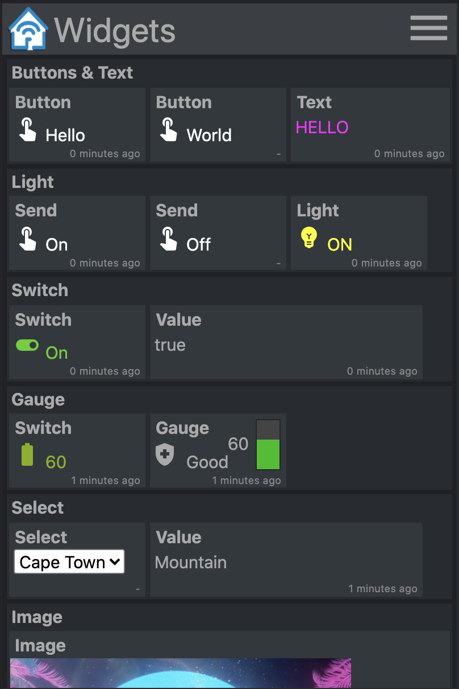
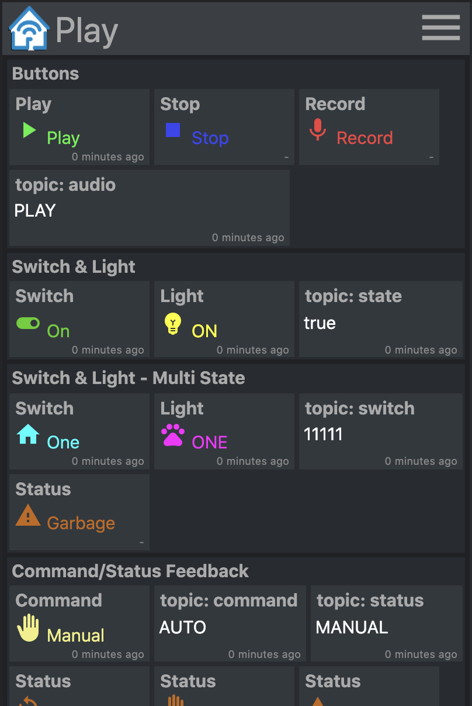
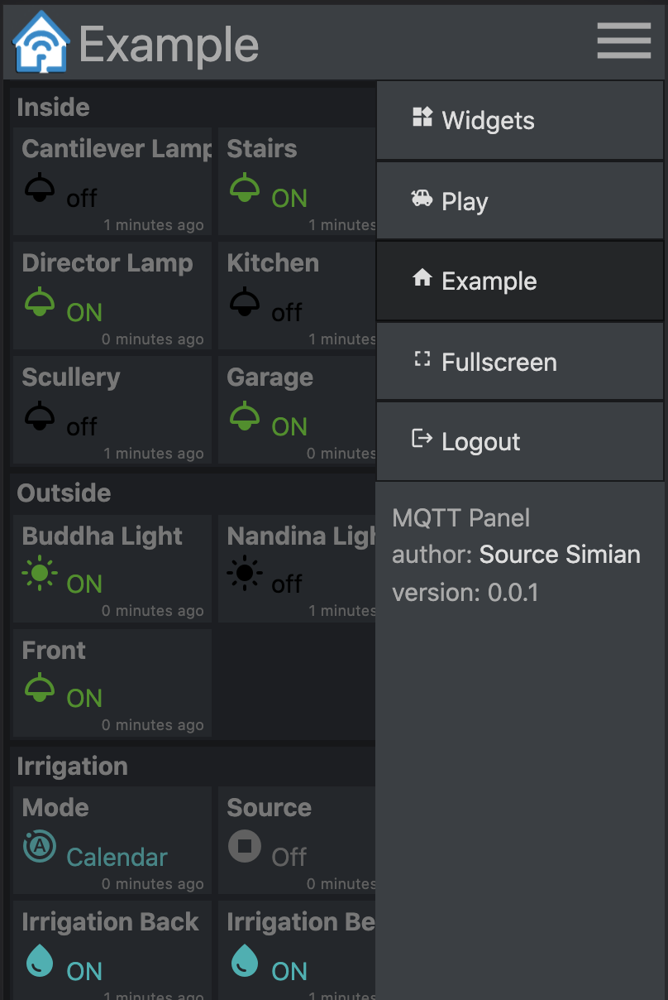

MQTT Panel <!-- omit in toc -->
===

***Self hosted Web App panel for MQTT***

This project provides a self hostable service that connects to a MQTT broker and serves a progressive web app panel which is fully configurable via YAML. It aims to be a simple panel that gives user interactivity with MQTT topics. Suitable for standalone or MQTT microservice deployments, and can be deployed alongside home automation solutions. It does not offer higher level capabilities such as automations, integrations or scheduling.

- [Demo](#demo)
- [Installation](#installation)
  - [Docker](#docker)
  - [Kubernetes](#kubernetes)
  - [MQTT Broker](#mqtt-broker)
- [Configuration](#configuration)
  - [Panels](#panels)
  - [Groups](#groups)
  - [Widgets](#widgets)
    - [Text](#text)
    - [Light](#light)
    - [Button](#button)
    - [Switch](#switch)
    - [Gauge](#gauge)
    - [Select](#select)
    - [Iframe](#iframe)
- [Contribution](#contribution)
  - [Development](#development)
- [License](#license)

# Demo
Run
```
docker run -it --rm -p 8080:8080 sourcesimian/mqtt-panel:latest
```
and browse to http://localhost:8080 which will appear as:
<div style="display: flex;">
  
  
  
</div>

# Installation
Prebuilt container images are available on [Docker Hub](https://hub.docker.com/r/sourcesimian/mqtt-panel).
## Docker
Run
```
mkdir -p $HOME/.cache/mqtt-panel

docker run -n mqtt-panel -d -it --rm -p 8080:8080 \
    --volume my-config.yaml:/config.yaml:ro \
    --volume $HOME/.cache/mqtt-panel:/data/cache:rw \
    sourcesimian/mqtt-panel:latest
```

## Kubernetes
Configure your Deployment to suffice the docker configuration above. Additionally you can add a liveness endpoint at `/api/health` on the configured http port. To perform SSL endpoint termination you can add an ingress controller such as [Traefik](https://traefik.io/) which comes standard with [K3s](https://k3s.io/).

A typical Deployment might include:
```
      volumes:
      - name: config
        configMap:
          name: mqtt-panel-config
      - name: data
        hostPath:
          path: /mnt/mqtt-panel/data
          type: DirectoryOrCreate
```

```
      containers:
      - name: mqtt-panel
        image: sourcesimian/mqtt-panel:latest
        ports:
        - containerPort: 8080
        volumeMounts:
        - name: config
          mountPath: /config.yaml
          subPath: config.yaml
        - name: data
          mountPath: /data
        livenessProbe:
          initialDelaySeconds: 30
          periodSeconds: 30
          httpGet:
            path: /api/health
            port: 8080
```
Kubernetes allows for the config file to be supplied in various ways. Using a ConfigMap the following commands are a convienient way to supply and update directly from your YAML:
```
kubectl -n "$NAMESPACE" delete configmap mqtt-panel-config &>/dev/null || true
kubectl -n "$NAMESPACE" create configmap mqtt-panel-config \
        --from-file=config.yaml=./config-my.yaml
kubectl -n "$NAMESPACE" rollout restart deploy mqtt-panel
```

## MQTT Broker
An installation of **mqtt-panel** will need a MQTT broker to connect to. There are many possibilities available. [Eclipse Mosquitto](https://github.com/eclipse/mosquitto/blob/master/README.md) is a great self hosted option with many installation options including prebuilt containers on [Docker Hub](https://hub.docker.com/_/eclipse-mosquitto). In the demo [EMQ X](https://www.emqx.io/), a free Open-Source, Cloud-Native broker, is used.

# Configuration
`mqtt-panel` consumes a single [YAML](https://yaml.org/) file. To start off you can copy [config-basic.yaml](./config-basic.yaml)

```
mqtt:
  host: <host>                  # optional: MQTT broker host, default: 127.0.0.1
  port: <port>                  # optional: MQTT broker port, default 1883
  username: <string>            # optional: MQTT broker username
  password: <string>            # optional: MQTT password username
  client-id: mqtt-panel         # MQTT client identifier, often brokers require this to be unique
  topic-prefix: <topic prefix>  # optional: Scopes the MQTT topic prefix
```
```
http:
  bind: <bind>                  # optional: Interface on which web server will listen, default 0.0.0.0
  port: <port>                  # Port on which web server will listen, default 8080
  max-connections: <integer>    # optional: Limit the number of concurrent connections, default 100
```
```
auth:                           # User Auth
  users:                        # optional: User/password auth
  - username: <string>
    password: <string>
```
```
cache:                          # Configure cache
  root: <path>                  # optional root path, default ./cache
```
```
logging:                        # Logging settings
  level: INFO                   # optional: Logging level, default DEBUG
```

## Panels
`mqtt-panel` is divided into panels, one panel is show at a time, each panel is a collection of groups.
```
panels:
  - title: <string>             # Panel title text
    icon: widgets               # Icon shown on the menu bar
    groups:                     # list of group identifiers
      - <identifier>            # e.g. "group_one"
  ... (repeat)
```


## Groups
A group is a boxed collection of widgets. They can be reused on multiple panels.
```
groups:
  - title: <string>             # Title text
    name: <identifier>          # Identifier, e.g. "group_one"
    widgets:                    # List of widgets in ths group
    ... (widgets)
  ... (repeat)
```

## Widgets
A widget is a functional element, which is used to publish and/or subscribe to MQTT topics, and display and/or input some payload.

All widgets have the following common attributes.:
```
    - title: <string>           # Title text
      type: <type>              # Widget type
      qos: [0 | 1 | 2]          # optional: MQTT QoS to use, default: 1
      retain: [False | True]    # optional: Publish with MQTT retain flag, default: False
      cache: [False | True]     # optional: Cache last seen payloads, default: False
      ref: <widget reference>   # optional: Identifier string for widget reuse.
```
`retain` is a flag that is set when publishing a payload to MQTT. If set the message will persist in the broker, clients will re-receive that payload when reconnecting. This does not always give the desired behaviour.

You will note that at startup some widgets show "unknown" until a payload on the subscribed MQTT topic is recieved. To improve user experience of mqtt-panel `cache: True` will preserve the last seen payload for a widget. This enables the server to immediately show the last known state after a restart, even with a MQTT topic using `retain: False`. 

To reuse a widget add the `ref` attribute, and then add the widget to other groups as:
```
    - ref: <widget reference>  # Identifier of widget to reuse
```


### Text
<!-- include:begin mqtt_panel/web/widget/text.md -->
Simply display the payload of the subscribed MQTT topic.
```
    - title: <string>       # Title text
      type: text            # Widget type
      subscribe: <topic>    # MQTT topic to listen on
      color: <color>        # optional: Color of the text
```
Example:
```
    - title: My Text
      type: text
      subscribe: text/content
      color: "#123456"
```
<!-- include:end --> 
### Light
<!-- include:begin mqtt_panel/web/widget/light.md -->
Display some text, an icon and color in when the defined payloads are received from the subscribed topic.
```
    - title: <string>       # Title text
      type: light           # Widget type
      subscribe: <topic>    # MQTT topic to listen on
      values:
      - payload: <string>     # Payload to match for this value
        text: <string>        # optional: Text shown
        icon: <icon>          # optional: Icon shown
        color: <color>        # optional: Color of icon and text
      ... (repeat)
```

Example:
```
    - title: My Light
      type: light
      subscribe: light/state
      values:
      - payload: "false"
        text: OFF
        color: black
        icon: light
      - payload: "true"
        text: ON
        color: yellow
        icon: light
```
<!-- include:end --> 
### Button
<!-- include:begin mqtt_panel/web/widget/button.md -->
Publish a constant value to a MQTT topic.
```
    - title: <string>       # Title text
      type: button          # Widget type
      text: <string>        # optional: Text to show on widget
      publish: <topic>      # MQTT topic to write to
      payload: <string>     # MQTT payload to publish
```
Example:
```
    - title: My Button
      type: button
      text: Push Me
      publish: button/command
      payload: PRESSED
```
<!-- include:end --> 

### Switch
<!-- include:begin mqtt_panel/web/widget/switch.md -->
Publish the next payload in the list of values to a topic. Update the display with text, icon and color when the payload returns on the subscribed topic.
```
    - title: <string>       # Title text
      type: switch          # Widget type
      publish: <topic>      # MQTT topic to write to
      subscribe: <topic>    # MQTT topic to listen on
      values:
      - payload: <string>     # Payload to match for this value
        text: <string>        # optional: Text shown
        icon: <icon>          # optional: Icon shown
        color: <color>        # optional: Color of icon and text
      ... (repeat)
```

Example:
```
    - title: My Switch
      type: switch
      publish: widget/switch/command
      subscribe: widget/switch/state
      values:
      - text: "Off"
        payload: "false"
      - text: "On"
        payload: "true"
```
<!-- include:end --> 
### Gauge
<!-- include:begin mqtt_panel/web/widget/gauge.md -->
Show the received value and a vertical bar gauge where the text, icon and color will change based on the value of the subscribed payload.
```
    - title: <string>       # Title text
      type: gauge           # Widget type
      subscribe: <topic>    # MQTT topic to listen on
      icon: <icon>          # optional: The default icon
      ranges:                       
      - range: [<float>, <float>] # Value for start and end of range
        text: <string>        # optional: Text shown when value in range
        color: <color>        # optional: Color shown when value in range
        icon: <icon>          # optional: Icon shown when value in range
      ... (repeat)              
                            # max and min value will be determined from starts and ends
```

Example:
```
    - title: Health
      type: gauge
      subscribe: gauge/health
      icon: health_and_safety
      ranges:
      - range: [0, 20]
        text: Poor
        color: red
        icon: warning
      - range: [20, 50]
        text: Moderate
        color: orange
      - range: [50, 80]
        text: Good
        color: yellow
      - range: [80, 100]
        text: Excellent
        color: green
```
<!-- include:end --> 
### Select
<!-- include:begin mqtt_panel/web/widget/select.md -->
Display a `<select>` box from which you can publish a list of values. Will update to matched payloads if subscribed to a topic.
```
    - title: <string>       # Title text
      type: select          # Widget type
      publish: <topic>      # MQTT topic to write to
      subscribe: <topic>    # optional: MQTT topic to listen on
      values:
      - payload: <string>     # Payload to send and match
        text: <string>        # Text shown in select
      ... (repeat)
```

Example:
```
    - title: My Select
      type: select
      publish: widget/select/command
      subscribe: widget/select/state
      values:
      - text: "Venice"
        payload: "Gondola"
      - text: "Cape Town"
        payload: "Mountain"
```
<!-- include:end --> 
### Iframe
<!-- include:begin mqtt_panel/web/widget/iframe.md -->
Display content in a `<iframe>`. The `src` attribute can be bound to a MQTT topic.
```
    - title: <string>       # Title text
      type: iframe          # Widget type
      subscribe: <topic>    # optional: MQTT topic to listen on, bound to iframe 'src'
      attr:                 # Attributes to be set on the iframe
        src: <url>            # optional: Can be set as a default vaule for 'src'
        ...                   # additional attributes
```

Example:
```
    - title: Iframe
      type: iframe
      subscribe: iframe/src
      attr:
        src: https://www.youtube.com/embed/dQw4w9WgXcQ
        width: 480px
        height: 315px
        title: YouTube video player
        allow: accelerometer; autoplay; clipboard-write; encrypted-media; gyroscope; picture-in-picture
        allowfullscreen:
```
<!-- include:end --> 

# Contribution
Yes sure! And please. I built mqtt-panel because I couldn't find a "I'm not ready to commit to full blown HA yet" solution that was self hosted and server side configurable. I don't know much about contemporary HTML, CSS and Typescript so I will gladly accept advice from those who know more. I want it to be a project that is quick and easy to get up and running, and helps open up MQTT to anyone.
## Development
Setup the virtualenv:

```
python3 -m venv virtualenv
. ./virtualenv/bin/activate
python3 ./setup.py develop
```

Run the server:

```
mqtt-panel ./config-demo.yaml
```

# License

In the spirit of the Hackers of the [Tech Model Railroad Club](https://en.wikipedia.org/wiki/Tech_Model_Railroad_Club) from the [Massachusetts Institute of Technology](https://en.wikipedia.org/wiki/Massachusetts_Institute_of_Technology), who gave us all so very much to play with. The license is [MIT](LICENSE).
